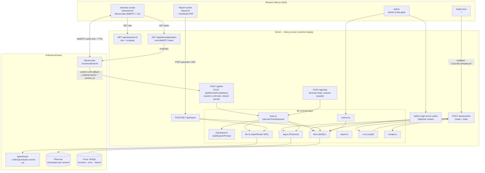
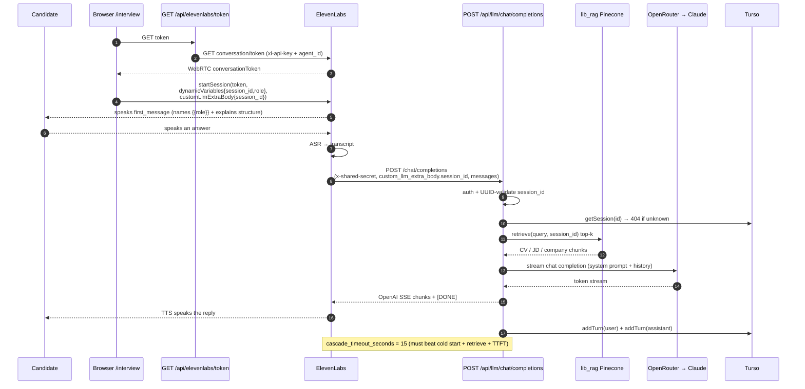
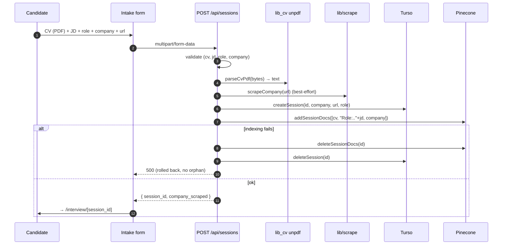
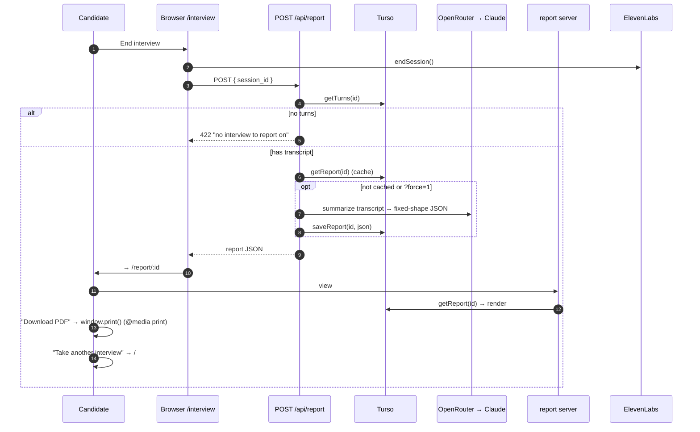
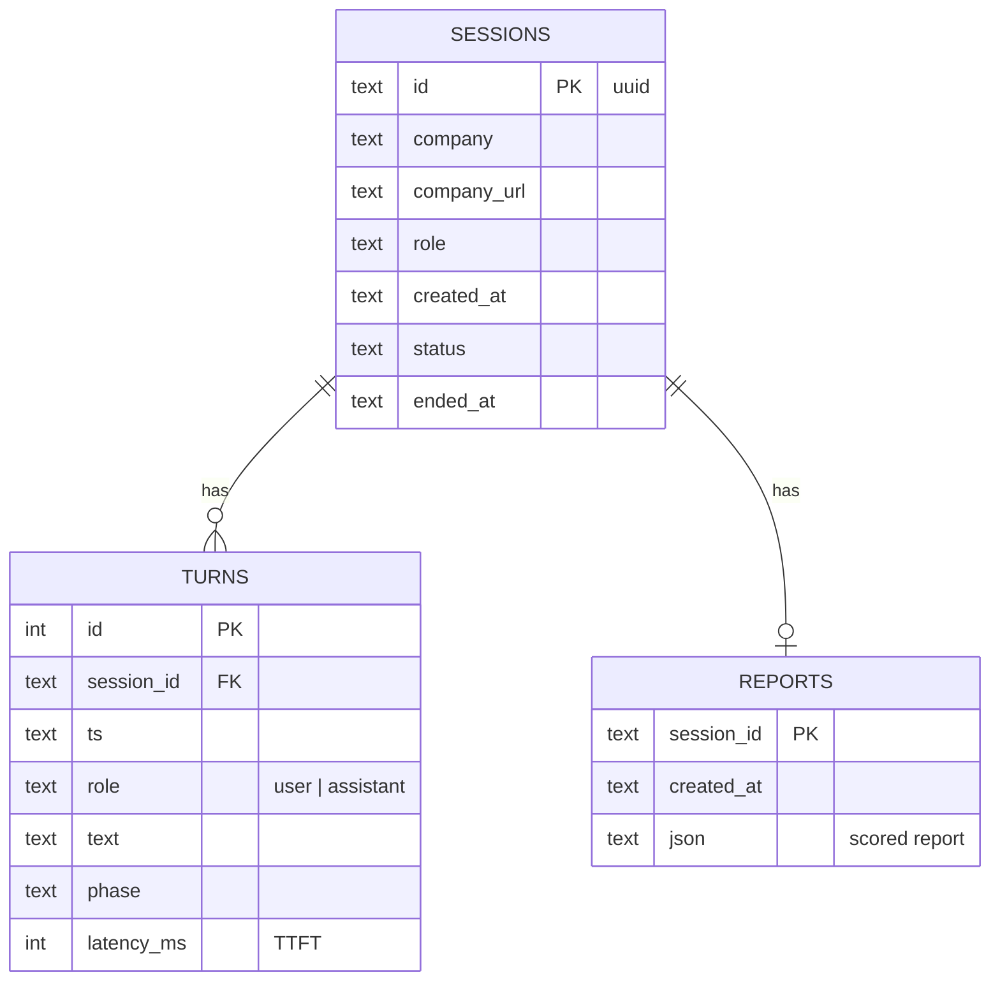
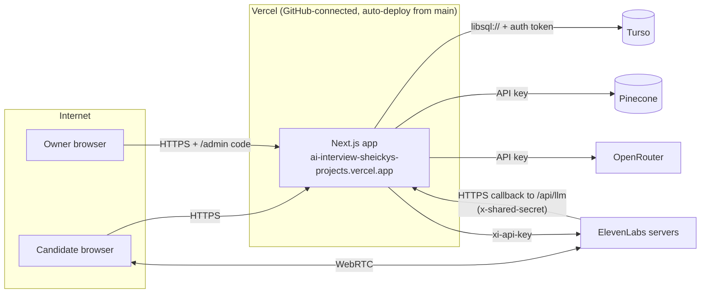
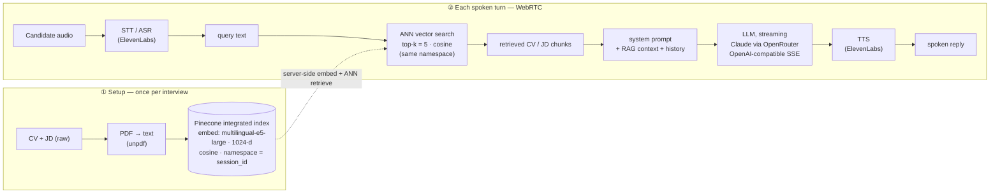

# System Design — AI Interview

Voice AI that runs a real, role-specific interview from a CV + job description, then produces a scored report.

> **Tip:** every diagram below is Mermaid. To get it into Excalidraw: open Excalidraw → menu → **"Mermaid to Excalidraw"** → paste one fenced `mermaid` block.

**Stack:** Next.js 16 (App Router, `nodejs` runtime) on Vercel · Turso (libSQL) · Pinecone (integrated index) · OpenRouter (→ Anthropic) · ElevenLabs Conversational AI (WebRTC voice + custom LLM).

---

## 1. High-level architecture

---

## 2. Voice interview — one turn (the core loop)

The browser never talks to the LLM directly. ElevenLabs handles speech↔text and calls **our** endpoint as its "custom LLM"; our brain grounds each turn in Pinecone and streams an OpenAI-compatible reply back.

---

## 3. Intake — create session + index documents

---

## 4. Report — generate + view + PDF

---

## 5. Data model

**Pinecone** is separate from the relational store: one **namespace per `session_id`** in the integrated index (`interview-docs`, model `multilingual-e5-large`), holding the CV / JD / company chunks. Deleting a session deletes its namespace (`deleteSessionDocs`).

---

## 6. Deployment & trust boundaries

**Secrets (env):** `PINECONE_API_KEY`, `PINECONE_INDEX`, `OPENROUTER_API_KEY`, `OPENROUTER_MODEL`, `SHARED_SECRET`, `ELEVENLABS_API_KEY`, `ELEVENLABS_AGENT_ID`, `DATABASE_URL`, `DATABASE_AUTH_TOKEN`, `ADMIN_CODE`.

**Auth posture:** session-scoped by URL (no login); `/api/llm*` requires `SHARED_SECRET`; `/admin` behind an httpOnly-cookie code gate. Vercel Deployment Protection must stay **off** (ElevenLabs has to reach `/api/llm`).

## 7. Wiring gotchas (load-bearing)
- ElevenLabs agent `custom_llm.url` = **base** `…/api/llm` (it appends `/chat/completions`). Full path → 404.
- `session_id` reaches the brain via **`customLlmExtraBody`** (the POST body), not `dynamicVariables` (prompt substitution only).
- `cascade_timeout_seconds = 15` so the custom LLM beats cold start + Pinecone + first token.
- One Pinecone namespace per session = hard isolation between candidates.

---

## 8. RAG pipeline (minimal — for a quick walkthrough)

The whole loop in one picture: **embed & store → STT → vector search → grounded LLM → TTS.** Pinecone is an *integrated* index, so embedding runs server-side (no embedding model in our code).

**~50s narration:** At setup, the CV and job description are parsed to text and sent to Pinecone, which **embeds** them server-side (`multilingual-e5-large`, 1024-dim, cosine) and stores the vectors in a **per-session namespace**. During the call (over WebRTC), each turn the candidate's audio is transcribed by **STT**; that text is the query for an **approximate-nearest-neighbour search** (top-5) in their namespace; the retrieved CV/JD chunks are injected into the **system prompt** alongside the history; **Claude** streams the next question back as OpenAI-compatible SSE; and **TTS** speaks it — grounded in this exact résumé and role.
